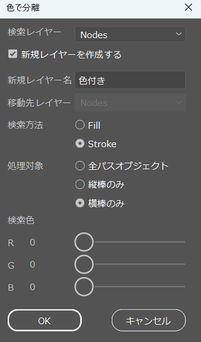

# FigTree2Ai

[FigTree](http://tree.bio.ed.ac.uk/software/figtree/)の吐き出したPDFファイルをイラレ（[Adobe Illustrator](https://www.adobe.com/jp/)）で扱えるように整形します。

スクリプト一覧

変更ログは[こちら](./version_log.md)

## 使い方

1. FigTreeのエクスポート機能でPDFを出力
1. イラレで当該PDFファイルを開く
1. クリッピングマスクの解除を2回行う
1. イラレの「ファイル>スクリプト>その他のスクリプト」でファイル選択画面に遷移，実行したいスクリプトを実行  
※Windowsの場合は `C:\Program Files\Adobe\Adobe Illustrator XXXX\Presets\ja_JP\スクリプト\` に配置すると一々参照せずに済みます

※スクリプト（JSファイル）のダウンロードは[Release欄](https://github.com/Funny-Silkie/FigTree2Ai/releases)から

バグ報告や要望等は[Issue](https://github.com/Funny-Silkie/FigTree2Ai/issues)へ

## init_tree.js

### 処理

- スケールバーの文字+バーをレイヤー「Scale Bar」にグループ化して移動
- BP値などのサポート値をレイヤー「Support Values」に移動
- 初期レイヤーにある謎の外枠を削除
- 全ての枝を縦棒と横棒に分割してレイヤー「Nodes」に移動
- ルートを削除

## migrate_color.js

### 処理

- 指定したRBGカラーのパスオブジェクトを指定したレイヤーへ移動
- パスオブジェクトの検索方法は色（Fill or Stroke）と種類（全て or 縦棒 or 横棒）から設定可能

### 使い方

1. 実行すると以下のウィンドウが表示されるので，処理の設定を行う  
   
1. 「OK」ボタンを押下
